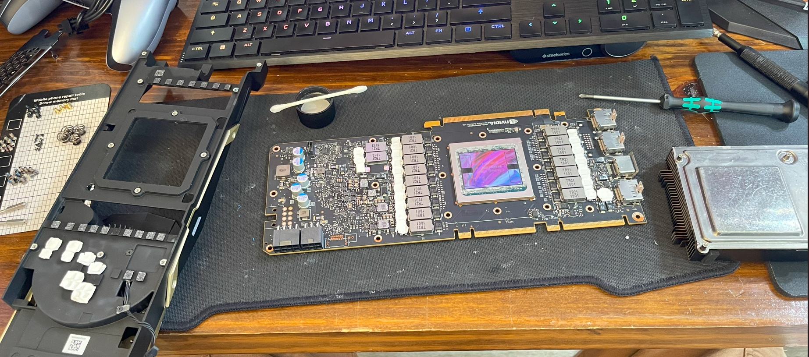
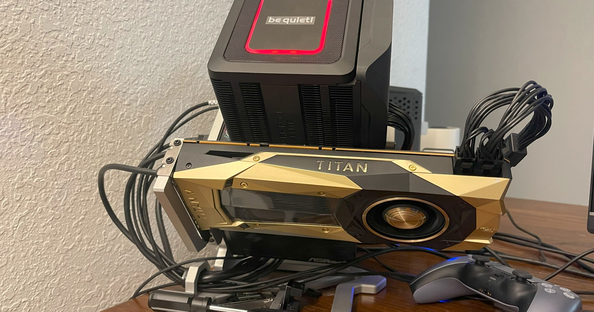

# Benchmarks

<b>Why so many GPU?</b> I love GPUs, there is just so much you can do with them. Crack passwords, mine fake money, play games, generate video/images/audio/code, chat with vector data in multi-dimensional tensor space, train models that can solve problems to difficult for code.

### Current GPU Roster

- AMD
    - ASRock Taichi OC RX 9070 XT 16GB
    - Sapphire Nitro+ RX Vega 64 8GB
    - MSI RX Vega 56 Air Boost OC 8GB
- Intel
    - Sparkle Titan OC ARC B580 12GB
    - Acer Predator BiFrost ARC A770 16GB
    - ASRock Challenger ARC A380 6GB
- Nvidia
    - ASUS Prime OC RTX 5070 Ti 16GB
    - Titan V 12GB
    - MSI Ventus OC RTX 2080 8GB
    - Titan XP 12GB (Latest version, different than Titan X Pascal)
    - PNY XLR8 GTX 1660 Super OC 6GB
    - GTX Titan 6GB (The OG)

### Finally got a good Titan V without blown components

### Test Rig

- AMD Ryzen 9 9950X3D
    - PBO on
    - PBO +200 Mhz Max
    - PBO factory Power/Voltage Limits
    - PBO no scaling
    - PBO max temp 85c
    - CO -20 all cores
      - Base CPU Testing
        - Cinebench R23 Multi Core: 44118
        - CPU Mark: 73984
        - CPU Mark Single Threaded: 4911
- be quiet! Dark Rock Elite Cooler
    - Thermalright Heilos V1 Phase Change Thermal Interface
- Monster Studio A45 Open Air Frame
- ASRock Steel Legend SL-1000G 1000w PSU
- ASUS ROG Strix B850i ITX Motherboard
- CORSAIR Vengeance 96GB (2 x 48GB) DDR5 6000 CL30 (CMK96GX5M2B6000Z30)
- 2 x Acer Predator GM7000 4TB Gen4 NVME

### LM Studio Inference Testing

- LM Studio Windows 11
  - Default Context Size
  - Seed: 65535
  - GPU Offload: Max / 100%
  - CPU Thread Pool Size: 12
  - Flash Attention Off
  - Test Prompt
    - "Tell me a real story about someone who never existed tasting the color red while walking through light while in a vacuum of low pressure clouds. This person is always there and knows what you will output so you must craft the story without there knowledge. In the story all things that are possible are impossible and must come before they were created. Describe time as a feeling that only dreams can see awake. Please write the story in under 500 words."
  - Some tests are ommitted due to VRAM limitations.

| Application | GPU | API | Offload |  Model | Parameters | Quant | Tok/sec | Tokens | Time To 1st Token | Notes |
| --- | --- | --- | --- | --- | --- | --- | --- | --- | --- | --- |
|  |  |  |  |  |  |  | Higher is better |  |  |  |
| LM Studio | RX 9070 XT Taichi | Vulkan | 100% | Gemma 3 Instruct | 1B | Q4 | 262.58 | 513 | 0.15s |  |
| LM Studio | Titan V | Cuda | 100% | Gemma 3 Instruct | 1B | Q4 | 90.72 | 530 | 0.03s |  |
| LM Studio | Titan V | Vulkan | 100% | Gemma 3 Instruct | 1B | Q4 | 110.62 | 518 | 0.79s |  |
| LM Studio | RTX 2080 | Cuda | 100% | Gemma 3 Instruct | 1B | Q4 | 104.08 | 518 | 0.79s |  |
| LM Studio | RTX 2080 | Vulkan | 100% | Gemma 3 Instruct | 1B | Q4 | 141.22 | 493 | 0.42s |  |
| LM Studio | ARC B580 | Vulkan | 100% | Gemma 3 Instruct | 1B | Q4 | 148.51 | 464 | 0.45s |  |
| LM Studio | RTX 5070 Ti | Cuda | 100% | Gemma 3 Instruct | 1B | Q4 | 277.01 | 573 | 0.02s |  |
| LM Studio | RTX 5070 Ti | Vulkan | 100% | Gemma 3 Instruct | 1B | Q4 | 177.85 | 498 | 0.64s |  |
| LM Studio | RTX 5070 Ti | Cuda | 100% | Gemma 3 Instruct | 1B | Q4 | 289.36 | 508 | 0.02s | Tuned OC UV - 116% Pwr - 990mv 3190 Mhz - +1500 VRAM |
| LM Studio | 9950X3D | CPU | 100% | Gemma 3 Instruct | 1B | Q4 | 65.95 | 540 | 0.17s |  |
| --- | --- | --- | --- | --- | --- | --- | --- | --- | --- | --- |
| LM Studio | RX 9070 XT Taichi | Vulkan | 100% | Gemma 3 Instruct | 4B | Q4 | 138.04 | 490 | 0.12s |  |
| LM Studio | Titan V | Cuda | 100% | Gemma 3 Instruct | 4B | Q4 | 61.63 | 494 | 0.10s |  |
| LM Studio | Titan V | Vulkan | 100% | Gemma 3 Instruct | 4B | Q4 | 67.48 | 495 | 0.65s |  |
| LM Studio | RTX 2080 | Cuda | 100% | Gemma 3 Instruct | 4B | Q4 | 65.79 | 487 | 0.06s |  |
| LM Studio | RTX 2080 | Vulkan | 100% | Gemma 3 Instruct | 4B | Q4 | 78.77 | 498 | 0.30s |  |
| LM Studio | ARC B580 | Vulkan | 100% | Gemma 3 Instruct | 4B | Q4 | 85.88 | 498 | 0.51s |  |
| LM Studio | RTX 5070 Ti | Cuda | 100% | Gemma 3 Instruct | 4B | Q4 | 157.17 | 487 | 0.03s |  |
| LM Studio | RTX 5070 Ti | Vulkan | 100% | Gemma 3 Instruct | 4B | Q4 | 120.10 | 502 | 0.07s |  |
| LM Studio | 9950X3D | CPU | 100% | Gemma 3 Instruct | 4B | Q4 | 22.10 | 485 | 0.42s |  |
| --- | --- | --- | --- | --- | --- | --- | --- | --- | --- | --- |
| LM Studio | RX 9070 XT Taichi | Vulkan | 100% | Gemma 3 Instruct | 12B | Q4 | 57.72 | 453 | 0.29s |  |
| LM Studio | Titan V | Cuda | 100% | Gemma 3 Instruct | 12B | Q4 | 21.99 | 485 | 0.45s |  |
| LM Studio | Titan V | Vulkan | 100% | Gemma 3 Instruct | 12B | Q4 | 30.49 | 517 | 1.98s |  |
| LM Studio | RTX 2080 | Cuda | 100% | Gemma 3 Instruct | 12B | Q4 | 15.10 | 514 | 0.48s |  |
| LM Studio | RTX 2080 | Vulkan | 100% | Gemma 3 Instruct | 12B | Q4 | 14.44 | 468 | 1.48s |  |
| LM Studio | ARC B580 | Vulkan | 100% | Gemma 3 Instruct | 12B | Q4 | 30.94 | 521 | 1.86s |  |
| LM Studio | RTX 5070 Ti | Cuda | 100% | Gemma 3 Instruct | 12B | Q4 | 66.34 | 517 | 0.05s |  |
| LM Studio | RTX 5070 Ti | Vulkan | 100% | Gemma 3 Instruct | 12B | Q4 | 53.05 | 483 | 0.71s |  |
| LM Studio | 9950X3D | CPU | 100% | Gemma 3 Instruct | 12B | Q4 | 8.92 | 513 | 2.52s |  |
| --- | --- | --- | --- | --- | --- | --- | --- | --- | --- | --- |
| LM Studio | RX 9070 XT Taichi | Vulkan | 100% | Llama 3.2 Instruct | 1B | Q4 | 368.71 | 514 | 0.00s |  |
| LM Studio | Titan V | Cuda | 100% | Llama 3.2 Instruct | 1B | Q4 | 139.34 | 518 | 0.03s |  |
| LM Studio | Titan V | Vulkan | 100% | Llama 3.2 Instruct | 1B | Q4 | 154.46 | 553 | 0.41s |  |
| LM Studio | RTX 2080 | Cuda | 100% | Llama 3.2 Instruct | 1B | Q4 | 149.57 | 502 | 0.02s |  |
| LM Studio | RTX 2080 | Vulkan | 100% | Llama 3.2 Instruct | 1B | Q4 | 163.41 | 478 | 0.43s |  |
| LM Studio | ARC B580 | Vulkan | 100% | Llama 3.2 Instruct | 1B | Q4 | 148.95 | 495 | 0.14s |  |
| LM Studio | RTX 5070 Ti | Cuda | 100% | Llama 3.2 Instruct | 1B | Q4 | 308.63 | 473 | 0.01s |  |
| LM Studio | RTX 5070 Ti | Vulkan | 100% | Llama 3.2 Instruct | 1B | Q4 | 275.50 | 509 | 0.34s |  |
| LM Studio | 9950X3D | CPU | 100% | Llama 3.2 Instruct | 1B | Q4 | 44.98 | 483 | 0.17s |  |
| --- | --- | --- | --- | --- | --- | --- | --- | --- | --- | --- |
| LM Studio | RX 9070 XT Taichi | Vulkan | 100% | Llama 3.2 Instruct | 3B | Q4 | 180.40 | 495 | 0.10s |  |
| LM Studio | Titan V | Cuda | 100% | Llama 3.2 Instruct | 3B | Q4 | 74.47 | 529 | 0.07s |  |
| LM Studio | Titan V | Vulkan | 100% | Llama 3.2 Instruct | 3B | Q4 | 80.76 | 558 | 0.49s |  |
| LM Studio | RTX 2080 | Cuda | 100% | Llama 3.2 Instruct | 3B | Q4 | 77.43 | 546 | 0.38s |  |
| LM Studio | RTX 2080 | Vulkan | 100% | Llama 3.2 Instruct | 3B | Q4 | 73.86 | 474 | 0.05s |  |
| LM Studio | ARC B580 | Vulkan | 100% | Llama 3.2 Instruct | 3B | Q4 | 65.57 | 482 | 0.35s |  |
| LM Studio | RTX 5070 Ti | Cuda | 100% | Llama 3.2 Instruct | 3B | Q4 | 158.97 | 523 | 0.02s |  |
| LM Studio | RTX 5070 Ti | Vulkan | 100% | Llama 3.2 Instruct | 3B | Q4 | 133.07 | 512 | 0.05s |  |
| LM Studio | RTX 5070 Ti | Cuda | 100% | Llama 3.2 Instruct | 3B | Q4 | 160.94 | 534 | 0.02s | Tuned OC UV - 116% Pwr - 990mv 3190 Mhz - +1500 VRAM |
| LM Studio | 9950X3D | CPU | 100% | Llama 3.2 Instruct | 3B | Q4 | 118.15 | 532 | 0.47s |  |
| --- | --- | --- | --- | --- | --- | --- | --- | --- | --- | --- |
| LM Studio | RX 9070 XT Taichi | Vulkan | 100% | Phi 4 | 15B | Q4 | 54.17 | 565 | 0.83s |  |
| LM Studio | Titan V | Cuda | 100% | Phi 4 | 15B | Q4 | 11.26 | 451 | 0.80s |  |
| LM Studio | Titan V | Vulkan | 100% | Phi 4 | 15B | Q4 | 35.89 | 467 | 1.59s |  |
| LM Studio | ARC B580 | Vulkan | 100% | Phi 4 | 15B | Q4 | 25.26 | 445 | 2.03s |  |
| LM Studio | RTX 5070 Ti | Cuda | 100% | Phi 4 | 15B | Q4 | 70.79 | 569 | 0.04s |  |
| LM Studio | RTX 5070 Ti | Vulkan | 100% | Phi 4 | 15B | Q4 | 60.75 | 422 | 0.48s |  |
| LM Studio | RTX 5070 Ti | Cuda | 100% | Phi 4 | 15B | Q4 | 73.47 | 428 | 0.04s | Tuned OC UV - 116% Pwr - 990mv 3190 Mhz - +1500 VRAM |
| LM Studio | 9950X3D | CPU | 100% | Phi 4 | 15B | Q4 | 7.12 | 462 | 1.74s |  |
| --- | --- | --- | --- | --- | --- | --- | --- | --- | --- | --- |
| LM Studio | RX 9070 XT Taichi | Vulkan | 100% | DeepSeek R1 Distill Llama | 8B | Q4 | 91.03 | 950 | 0.18s |  |
| LM Studio | Titan V | Cuda | 100% | DeepSeek R1 Distill Llama | 8B | Q4 | 56.23 | 891 | 0.18s |  |
| LM Studio | Titan V | Vulkan | 100% | DeepSeek R1 Distill Llama | 8B | Q4 | 54.78 | 1253 | 0.13s |  |
| LM Studio | RTX 2080 | Cuda | 100% | DeepSeek R1 Distill Llama | 8B | Q4 | 52.33 | 1306 | 0.09s |  |
| LM Studio | RTX 2080 | Vulkan | 100% | DeepSeek R1 Distill Llama | 8B | Q4 | 56.12 | 895 | 0.54s |  |
| LM Studio | ARC B580 | Vulkan | 100% | DeepSeek R1 Distill Llama | 8B | Q4 | 59.73 | 956 | 0.95s |  |
| LM Studio | RTX 5070 Ti | Cuda | 100% | DeepSeek R1 Distill Llama | 8B | Q4 | 118.50 | 758 | 0.03s |  |
| LM Studio | RTX 5070 Ti | Vulkan | 100% | DeepSeek R1 Distill Llama | 8B | Q4 | 96.15 | 1394 | 0.08s |  |
| LM Studio | 9950X3D | CPU | 100% | DeepSeek R1 Distill Llama | 8B | Q4 | 12.73 | 919 | 0.73s |  |
| --- | --- | --- | --- | --- | --- | --- | --- | --- | --- | --- |
| LM Studio | RX 9070 XT Taichi | Vulkan | 100% | DeepSeek R1 Distill Qwen | 14B | Q4 | 51.94 | 801 | 0.40s |  |
| LM Studio | Titan V | Cuda | 100% | DeepSeek R1 Distill Qwen | 14B | Q4 | 18.08 | 1022 | 0.48s |  |
| LM Studio | Titan V | Vulkan | 100% | DeepSeek R1 Distill Qwen | 14B | Q4 | 32.93 | 1112 | 1.75s |  |
| LM Studio | ARC B580 | Vulkan | 100% | DeepSeek R1 Distill Qwen | 14B | Q4 | 19.66 | 1901 | 1.95s |  |
| LM Studio | RTX 5070 Ti | Cuda | 100% | DeepSeek R1 Distill Qwen | 14B | Q4 | 66.80 | 900 | 0.05s |  |
| LM Studio | RTX 5070 Ti | Vulkan | 100% | DeepSeek R1 Distill Qwen | 14B | Q4 | 54.98 | 1032 | 0.14s |  |
| LM Studio | RTX 5070 Ti | Cuda | 100% | DeepSeek R1 Distill Qwen | 14B | Q4 | 69.57 | 786 | 0.04s | Tuned OC UV - 116% Pwr - 990mv 3190 Mhz - +1500 VRAM |
| LM Studio | 9950X3D | CPU | 100% | DeepSeek R1 Distill Qwen | 14B | Q4 | 6.81 | 765 | 1.44s |  |
| --- | --- | --- | --- | --- | --- | --- | --- | --- | --- | --- |
| LM Studio | RX 9070 XT Taichi | Vulkan | 100% | DeepSeek R1 Distill Qwen | 7B | Q4 | 94.61 | 1190 | 0.17s |  |
| LM Studio | Titan V | Cuda | 100% | DeepSeek R1 Distill Qwen | 7B | Q4 | 59.96 | 1090 | 0.18s |  |
| LM Studio | Titan V | Vulkan | 100% | DeepSeek R1 Distill Qwen | 7B | Q4 | 59.27 | 1582 | 0.88s |  |
| LM Studio | RTX 2080 | Cuda | 100% | DeepSeek R1 Distill Qwen | 7B | Q4 | 56.45 | 1273 | 0.29s |  |
| LM Studio | RTX 2080 | Vulkan | 100% | DeepSeek R1 Distill Qwen | 7B | Q4 | 54.18 | 974 | 0.71s |  |
| LM Studio | ARC B580 | Vulkan | 100% | DeepSeek R1 Distill Qwen | 7B | Q4 | 62.70 | 1365 | 0.87s |  |
| LM Studio | RTX 5070 Ti | Cuda | 100% | DeepSeek R1 Distill Qwen | 7B | Q4 | 123.35 | 1521 | 0.03s |  |
| LM Studio | RTX 5070 Ti | Vulkan | 100% | DeepSeek R1 Distill Qwen | 7B | Q4 | 100.59 | 1174 | 0.09s |  |
| LM Studio | 9950X3D | CPU | 100% | DeepSeek R1 Distill Qwen | 7B | Q4 | 13.40 | 1143 | 0.70s |  |
| --- | --- | --- | --- | --- | --- | --- | --- | --- | --- | --- |
| LM Studio | RX 9070 XT Taichi | Vulkan | 100% | Qwen 2.5 Coder Instruct | 3B | Q4 | 175.49 | 477 | 0.11s |  |
| LM Studio | Titan V | Cuda | 100% | Qwen 2.5 Coder Instruct | 3B | Q4 | 73.84 | 431 | 0.17s |  |
| LM Studio | Titan V | Vulkan | 100% | Qwen 2.5 Coder Instruct | 3B | Q4 | 80.39 | 488 | 0.66s |  |
| LM Studio | RTX 2080 | Cuda | 100% | Qwen 2.5 Coder Instruct | 3B | Q4 | 81.28 | 537 | 0.06s |  |
| LM Studio | RTX 2080 | Vulkan | 100% | Qwen 2.5 Coder Instruct | 3B | Q4 | 98.00 | 308 | 0.51s |  |
| LM Studio | ARC B580 | Vulkan | 100% | Qwen 2.5 Coder Instruct | 3B | Q4 | 103.54 | 676 | 0.48s |  |
| LM Studio | RTX 5070 Ti | Cuda | 100% | Qwen 2.5 Coder Instruct | 3B | Q4 | 182.14 | 411 | 0.03s |  |
| LM Studio | RTX 5070 Ti | Vulkan | 100% | Qwen 2.5 Coder Instruct | 3B | Q4 | 145.92 | 337 | 0.06s |  |
| LM Studio | 9950X3D | CPU | 100% | Qwen 2.5 Coder Instruct | 3B | Q4 | 29.05 | 433 | 0.42s |  |
| --- | --- | --- | --- | --- | --- | --- | --- | --- | --- | --- |
| LM Studio | RX 9070 XT Taichi | Vulkan | 100% | Qwen 2.5 Coder Instruct | 14B | Q4 | 52.97 | 494 | 0.40s |  |
| LM Studio | Titan V | Cuda | 100% | Qwen 2.5 Coder Instruct | 14B | Q4 | 18.97 | 517 | 0.59s |  |
| LM Studio | Titan V | Vulkan | 100% | Qwen 2.5 Coder Instruct | 14B | Q4 | 33.38 | 513 | 1.74s |  |
| LM Studio | ARC B580 | Vulkan | 100% | Qwen 2.5 Coder Instruct | 14B | Q4 | 22.61 | 546 | 2.01s |  |
| LM Studio | RTX 5070 Ti | Cuda | 100% | Qwen 2.5 Coder Instruct | 14B | Q4 | 68.06 | 442 | 0.06s |  |
| LM Studio | RTX 5070 Ti | Vulkan | 100% | Qwen 2.5 Coder Instruct | 14B | Q4 | 55.96 | 507 | 0.14s |  |
| LM Studio | 9950X3D | CPU | 100% | Qwen 2.5 Coder Instruct | 14B | Q4 | 6.93 | 518 | 1.74s |  |
| --- | --- | --- | --- | --- | --- | --- | --- | --- | --- | --- |
| LM Studio | RX 9070 XT Taichi | Vulkan | 100% | Qwen 2.5 Instruct 1M | 7B | Q4 | 97.47 | 590 | 0.17s |  |
| LM Studio | Titan V | Cuda | 100% | Qwen 2.5 Instruct 1M | 7B | Q4 | 60.67 | 530 | 0.17s |  |
| LM Studio | Titan V | Vulkan | 100% | Qwen 2.5 Instruct 1M | 7B | Q4 | 60.06 | 658 | 0.86s |  |
| LM Studio | RTX 2080 | Cuda | 100% | Qwen 2.5 Instruct 1M | 7B | Q4 | 59.13 | 534 | 0.09s |  |
| LM Studio | RTX 2080 | Vulkan | 100% | Qwen 2.5 Instruct 1M | 7B | Q4 | 60.41 | 602 | 0.58s |  |
| LM Studio | ARC B580 | Vulkan | 100% | Qwen 2.5 Instruct 1M | 7B | Q4 | 64.10 | 610 | 0.87s |  |
| LM Studio | RTX 5070 Ti | Cuda | 100% | Qwen 2.5 Instruct 1M | 7B | Q4 | 124.51 | 569 | 0.03s |  |
| LM Studio | RTX 5070 Ti | Vulkan | 100% | Qwen 2.5 Instruct 1M | 7B | Q4 | 102.04 | 684 | 0.09s |  |
| LM Studio | RTX 5070 Ti | Cuda | 100% | Qwen 2.5 Instruct 1M | 7B | Q4 | 129.16 | 507 | 0.03s | Tuned OC UV - 116% Pwr - 990mv 3190 Mhz - +1500 VRAM |
| LM Studio | 9950X3D | CPU | 100% | Qwen 2.5 Instruct 1M | 7B | Q4 | 12.59 | 616 | 0.83s |  |

### Amuse Stable Diffusion DirectML Testing

- Amuse v2.2.2 beta Windows 11
  - EZ Mode
  - Fast Model
    - Dreamshaper v7 LCM
  - Balanced Model
    - SDXL Turbo for all devices
  - Image Count: 4
  - Prompt: "Terminator endoskeleton high fiving a clown at a birthday party. Neon lights in a cyberpunk scene shining on wet surfaces reflecting light can be seen."
  - 3 runs will be made, the elapsed time and iterations per second will be taken from the 3rd run.

| Application | GPU | API | Image Count | Performance | Elapsed Time Seconds | Iterations Per Second | Notes |
| --- | --- | --- | --- | --- | --- | --- | --- |
|  |  |  |  |  | Lower is better | Higher is better |  |
| Amuse | Titan V | DirectML | 4 | Fast | 3.2s | 11.5 |  |
| Amuse | Titan V | DirectML | 4 | Balanced | 3.3s | 7.9 |  |
| Amuse | RTX 2080 | DirectML | 4 | Fast | 3.3s | 11.4 |  |
| Amuse | RTX 2080 | DirectML | 4 | Balanced | 10.3s | 1.9 | VRAM spilling over to system RAM |
| Amuse | ARC B580 | DirectML | 4 | Fast | 2.7s | 17 |  |
| Amuse | ARC B580 | DirectML | 4 | Balanced | 2.6s | 11.5 |  |
| Amuse | RTX 5070 Ti | DirectML | 4 | Fast | 2.4s | 16.3 |  |
| Amuse | RTX 5070 Ti | DirectML | 4 | Balanced | 1.9s | 16.7 |  |
| Amuse | RTX 5070 Ti | DirectML | 4 | Fast | 2.3s | 16.2 | Tuned OC UV - 116% Pwr - 990mv 3190 Mhz - +1500 VRAM |
| Amuse | RTX 5070 Ti | DirectML | 4 | Balanced | 1.8s | 18.8 | Tuned OC UV - 116% Pwr - 990mv 3190 Mhz - +1500 VRAM |

### PyTorch Testing

- PyTorch testing will be somewhat unique to each technology as they all have different requirements.
    - BERT Tokenizer
        - This test can run on ROCm/Cuda, XPU and CPU
        - This is mostly a heat generator and not functional but it does stress GPUs
        - This test does not play well with DirectML in PyTorch so we will need to wait for ROCm updates for RDNA4 testing

| Application | GPU | API | Test | Elapsed Time Seconds | Notes |
| --- | --- | --- | --- | --- | --- |
|  |  |  |  | Lower is better |  |
| PyTorch | 9950X3D | CPU | BERT Tokenizer | 993.65s | This is actually incredibly fast for cpu |
| PyTorch | Titan V | Cuda | BERT Tokenizer | 83.19s |  |
| PyTorch | RTX 2080 | Cuda | BERT Tokenizer | 124.49s |  |
| PyTorch | ARC B580 | XPU | BERT Tokenizer | 113.41s |  |
| PyTorch | RTX 5070 Ti | Cuda | BERT Tokenizer | 55.36 |  |
| PyTorch | RTX 5070 Ti | Cuda | BERT Tokenizer | 51.03 | Tuned OC UV - 116% Pwr - 990mv 3190 Mhz - +1500 VRAM |
|  |  |  |  |  | Previously tested devices below, same code |
| PyTorch | i9-14900K | CPU | BERT Tokenizer | 2381.41s |  |
| PyTorch | ARC A770 | XPU | BERT Tokenizer | 176.26s | WSL2 |
| PyTorch | RTX 3080 FE | Cuda | BERT Tokenizer | 75.68s |  |
| PyTorch | Google Colab Tesla T4 | Cuda | BERT Tokenizer | 177.52s |  |
| PyTorch | Google Colab A100 | Cuda | BERT Tokenizer | 55.05s |  |
| PyTorch | Google Colab L4 | Cuda | BERT Tokenizer | 109.60s |  |
| PyTorch | RTX 3090 Ti FE | Cuda | BERT Tokenizer | 69.82s |  |
| PyTorch | RTX 3090 Ti FE | Cuda | BERT Tokenizer | 55.48s | Ubuntu 24.04 LTS |
