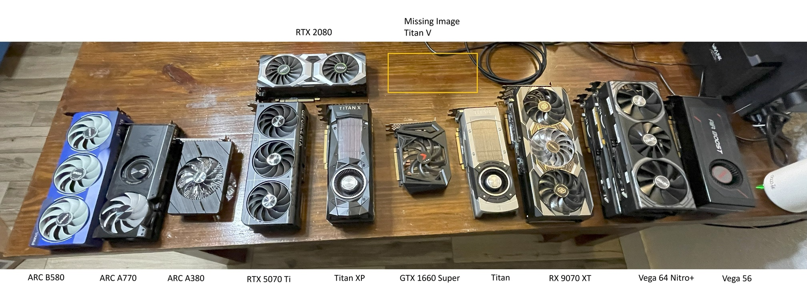
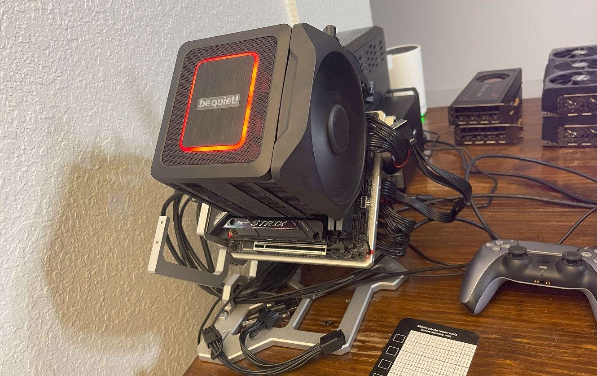

# Benchmarks

I have sold off most of my little gpu collection but I kept a couple drawers full and want to see how some of these test in 2025. The newest card (RX 9070 XT) was release a few weeks ago and the oldest card (GTX Titan) is over 12 years old.

Some of these test will not apply to every card due to either software or vram limitations. When applicable tests will include mixed precision where available. Also, not pictured I have an Nvidia Titan V shipping in today. I have bought a few of these on ebay and all of them have blown power delivery components. I will tear this card down when received, fully inspect the card and do a putty and phase change job on the enormous die.

<b>Why:</b> I have a couple weeks off in between jobs and want to try to run through some testing to put together data maybe the next guy learning some pytorch/tensorflow/ML-AI stuffs can use.

<b>Why so many GPU?</b> I love GPUs, there is just so much you can do with them. Crack passwords, mine fake money, play games, generate video/images/audio/code, chat with vector data in multi-dimensional tensor space, train models that can solve problems to difficult for code.

#### Current GPUs

- AMD
    - ASRock Taichi OC RX 9070 XT 16GB
    - Sapphire Nitro+ RX Vega 64 8GB
    - MSI RX Vega 56 Air Boost OC 8GB
- Intel
    - Sparkle Titan OC ARC B580 12GB
    - Acer Predator BiFrost ARC A770 16GB
    - ASRock Challenger ARC A380 6GB
- Nvidia
    - ASUS Prime OC RTX 5070 Ti 16GB
    - MSI Ventus OC RTX 2080 8GB
    - Titan XP 12GB (Latest version, different than Titan X Pascal)
    - PNY XLR8 GTX 1660 Super OC 6GB
    - GTX Titan 6GB (The OG)

